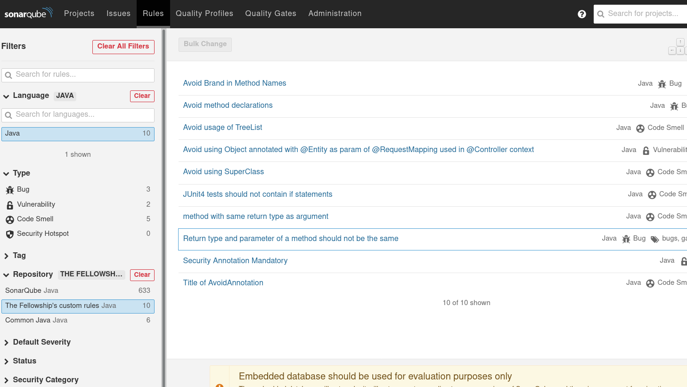
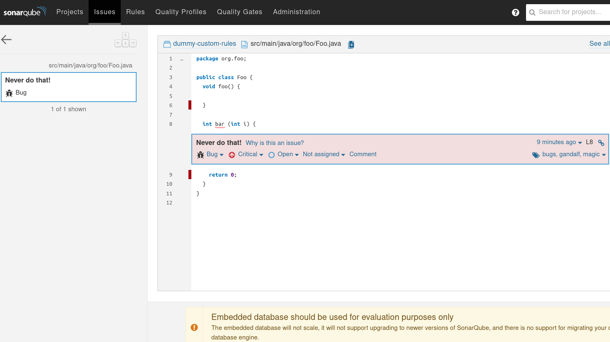

# EPFL Sonar Workshop (October 2023)

This repository serves as the base project to implement custom rules for Java.
It is derived from the [base template of the sonar-java project](https://github.com/SonarSource/sonar-java/tree/1947bdb5bec965afcee43087febf32245cb06253/docs/java-custom-rules-example).
For a more up-to-date and detailed version of this tutorial, please refer to the official tutorial, [Writing Custom Java Rules 101](https://github.com/SonarSource/sonar-java/blob/1947bdb5bec965afcee43087febf32245cb06253/docs/CUSTOM_RULES_101.md).

## Content

* [A brief introduction to SonarQube](#a-brief-introduction-to-sonarqube)
  * [Downloading SonarQube 9.9](#downloading-sonarqube-99)
  * [Starting SonarQube](#starting-sonarqube)
  * [Exploring SonarQube](#exploring-sonarqube)
    * [Rules](#rules)
    * [Quality profiles](#quality-profiles)
    * [Quality gates](#quality-gates)
* [Getting Started with custom plugin development](#getting-started)
  * [Looking at the pom](#looking-at-the-pom)
* [Writing a rule together](#writing-a-rule)
  * [Three files to forge a rule](#three-files-to-forge-a-rule)
  * [Defining expectations](#defining-expectations)
  * [Bringing it together](#bringing-it-together)
  * [First version: Using syntax trees and API basics](#first-version-using-syntax-trees-and-api-basics)
  * [Second version: Using semantic API](#second-version-using-semantic-api)
  * [What you can use, and what you can't](#what-you-can-use-and-what-you-cant)
* [Registering the rule in the custom plugin](#registering-the-rule-in-the-custom-plugin)
  * [Rule Metadata](#rule-metadata)
  * [Rule Activation](#rule-activation)
  * [Rule Registrar](#rule-registrar)
* [Testing a custom plugin](#testing-a-custom-plugin)
* [Writing a rule on your own](#writing-a-rule-on-your-own)
* [Tips and Tricks](#tips-and-tricks)
* [Additional resources](#additional-resources)

## A brief introduction to SonarQube

### Downloading SonarQube 9.9

Start by getting a copy of SonarQube 9.9 Community edition from the [SonarQube website](https://binaries.sonarsource.com/Distribution/sonarqube/sonarqube-9.9.2.77).

### Starting SonarQube

Unzip the archive, get into the unzipped folder and open a terminal.
To start SonarQube, run:

```shell
# Linux
./bin/linux-x86-64/sonar.sh console
# Mac OS
./bin/macosx-universal-64/sonar.sh console
# Windows
bin\windows-x86-64\StartSonar.bat
```

After a few seconds, you should be able to connect to your instance on [http://localhost:9000]([http://localhost:9000]).

Login with the default credentials (user: admin, password: admin) and update with a new password of your choice.

### Exploring SonarQube

With your new running instance, let's get familiar with some of the concepts in the Sonar ecosystem.

#### Rules

You should be able to list all the rules available to you by browsing on the [rules page](http://localhost:9000/coding_rules).
You can play around with the filters.

Note how every rule has:

- A unique key
- A description
- A type
- A severity
- A repository of origin

Additionally, a rule may have:

- Multiple language implementations
- Tags
- Customizable parameters

---
Before moving on, ask yourself:

- How many rules are there for Java?
- How many rules are there that apply both for Java and Kotlin?
- Can you find a rule with a customizable parameter?

---

#### Quality profiles

In order to apply a set of rules to your project, they can be grouped as __quality profiles__.
Sonar provides default a quality profile named "Sonar way".
It serves as the default quality profile.

Such a profile can then be:

- copied (an identical separate copy that can be modified)
- extended (depends on the original one that can receive updates but can bring its own modifications)

The new profiles can then be set as defaults for our SonarQube instance or just used for some of our existing projects.

---
Before moving on, ask yourself:

- How many rules are there in the "Sonar Way" quality profile for Java?
- Is there a difference with the number of available rules?

---

#### Quality gates

To get a quick look at your project's health and ensure a reasonable state, [Quality Gates](http://localhost:9000/quality_gates/) can prove useful.
It is a combination of a quality profile and a set of conditions that should be matched.
The quality gate can either pass (turning green) or  fail (turning red).
You can leverage this quality gate toggle in your CI pipeline to block releases or trigger alerts for your development team.

---
Before moving on, ask yourself:

- What is the name of the default quality gate?
- Is this quality gate applied to all code?

---

## Analyzing your first project with SonarQube

We are going to analyze our first project with SonarQube.
First, clone or get a copy of the [spring-petclinic project](https://github.com/spring-projects/spring-petclinic).
Then follow the instructions to get the project analyzed.

- On the ["How do you want to create your project?"](http://localhost:9000/projects/create) Select ["Manually"](http://localhost:9000/projects/create?mode=manual).
- Enter "spring-petclinic" as the project name and project key, and click "Set Up"
- Select ["Locally"](http://localhost:9000/dashboard?id=epfl-sonar-workshop&selectedTutorial=local),
- On the "Provide a token" step, create the 30-days token and __make a copy of it__.
- On the "Run analysis on your project" step, select Maven and __make a copy of the command suggested by SonarQube__
- __Before running the command, replace "mvn" with "./mvnw" on Linux/Mac__
- Open a terminal at the root of the project and run the command suggested by SonarQube

If the command succeeds, your browser tab should update soon with the results of the analysis.

Take some time to look around and explore the results of the analysis.

---
Before moving on, ask yourself:

- How many issues are detected?
- What is the status of the quality gate?
- What is the version of the project you analyzed?
- How many lines of code are there in the project?

---

## Writing a rule together

The rules you develop will be delivered using a dedicated, custom plugin, relying on the __SonarSource Analyzer for Java API__.
In order to start working efficiently, we provide a template Maven project that you will fill in while following this tutorial.

Grab the template project by cloning [this repository](https://github.com/SonarSource/sonar-java) and then importing in your IDE the sub-module [java-custom-rules-examples](https://github.com/SonarSource/sonar-java/tree/master/docs/java-custom-rules-example).
This project already contains examples of custom rules. Our goal will be to add an extra rule!

### Looking at the POM

A custom plugin is a Maven project, and before diving into code, it is important to notice a few relevant lines related to the configuration of your soon-to-be-released custom plugin.
The root of a Maven project is a file named `pom.xml`.

Let's start by building the custom-plugin template by using the following command:

```shell
./mvnw clean verify
```

Looking inside the `pom`, you will see that both SonarQube and the Java Analyzer versions are hard-coded.
This is because SonarSource's analyzers are directly embedded in the various SonarQube versions and are shipped together.
For instance, SonarQube `8.9` (previous LTS) is shipped with version `6.15.1.26025` of the Java Analyzer, while SonarQube `9.9` (LTS) is shipped with a much more recent version `7.16.0.30901` of the Java Analyzer.
__These versions cannot be changed__.

```xml
  <groupId>org.sonar.samples.java</groupId>
  <artifactId>epfl-sonar-workshop</artifactId>
  <packaging>sonar-plugin</packaging>
  <name>EPFL Sonar Workshop</name>
  <description>A custom rule plugin for SonarQube</description>
```

### A rule specification

Every rule starts with a description of sort.
It describes the purpose and scope of the rule.

It can sometimes be arbitrary, see the following for example.

> *“For a method having a single parameter, the types of its return value and its parameter should never be the same.”*

We now have an arbitrary but scoped rule specification, let's implement the actual logic.

### Three files to forge a rule

In this section, we will write a custom rule from scratch.
To do so, we will use a [Test Driven Development](https://en.wikipedia.org/wiki/Test-driven_development) (TDD) approach, relying on writing some test cases first, followed by the implementation of a solution.

Let's first start by describing the rule we want to implement.

When implementing a rule, there is always a minimum of three distinct files to create:

1. A test file, which contains Java code used as input data for testing the rule
2. A test class, which contains the rule's unit test
3. A rule class, which contains the implementation of the rule.

To create our first custom rule (usually called a "*check*"), let's start by creating these three files in the template project, as described below:

1. In folder `/src/test/files`, create a new empty file named `ReturnTypeDifferentFromSingleParameterSample.java`, and copy-paste the content of the following code snippet.

```java
class MyClass {
}
```

2. In package `org.sonar.samples.java.checks` of `/src/test/java`, create a new test class called `ReturnTypeDifferentFromSingleParameterCheckTest` and copy-paste the content of the following code snippet.

```java
package org.sonar.samples.java.checks;
 
import org.junit.jupiter.api.Test;

class ReturnTypeDifferentFromSingleParameterCheckTest {

  @Test
  void test() {
  }

}
```

3. In package `org.sonar.samples.java.checks` of `/src/main/java`, create a new class called `ReturnTypeDifferentFromSingleParameterCheck` extending class `org.sonar.plugins.java.api.IssuableSubscriptionVisitor` provided by the Java Plugin API.
Then, replace the content of the `nodesToVisit()` method with the content from the following code snippet.
This file will be described when dealing with the implementation of the rule!

```java
package org.sonar.samples.java.checks;

import org.sonar.check.Rule;
import org.sonar.plugins.java.api.IssuableSubscriptionVisitor;
import org.sonar.plugins.java.api.tree.Tree.Kind;
import java.util.Collections;
import java.util.List;

@Rule(key = "ReturnTypeDifferentFromSingleParameter")
public class ReturnTypeDifferentFromSingleParameterCheck extends IssuableSubscriptionVisitor {

  @Override
  public List<Kind> nodesToVisit() {
    return Collections.emptyList();
  }
  
}
```

### Defining expectations

Because we chose a TDD approach, the first thing to do is to write examples of the code our rule will target.
In this file, we consider numerous cases that our rule may encounter during an analysis, and flag the lines which will require our implementation to raise issues.
The flag to be used is a simple `// Noncompliant` trailing comment on the line of code where an issue should be raised.
Why *Noncompliant*? Because the flagged lines do not *comply* with the rule.

Covering all the possible cases is not necessarily required, the goal of this file is to cover all the situations which may be encountered during an analysis, but also to abstract irrelevant details.
For instance, in the context of our first rule, the name of a method, the content of its body, and the owner of the method make no difference, whether it's an abstract class, a concrete class, or an interface. 
Note that this sample file should be structurally correct and all code should compile.

In the test file `ReturnTypeDifferentFromSingleParameterSample.java` created earlier, copy-paste the following code:

```java
class MyClass {
  MyClass(MyClass mc) { }

  int     foo1() { return 0; }
  void    foo2(int value) { }
  int     foo3(int value) { return 0; } // Noncompliant
  Object  foo4(int value) { return null; }
  MyClass foo5(MyClass value) { return null; } // Noncompliant

  int     foo6(int value, String name) { return 0; }
  int     foo7(int ... values) { return 0;}
}
```

The test file now contains the following test cases:

* __line 2:__ A constructor, to differentiate the case from a method;
* __line 4:__ A method without parameter (`foo1`);
* __line 5:__ A method returning void (`foo2`);
* __line 6:__ A method returning the same type as its parameter (`foo3`), which will be noncompliant;
* __line 7:__ A method with a single parameter, but a different return type (`foo4`);
* __line 8:__ Another method with a single parameter and same return type, but with non-primitive types (`foo5`), therefore noncompliant too;
* __line 10:__ A method with more than 1 parameter (`foo6`);
* __line 11:__ A method with a variable arity argument (`foo7`);

### Bringing it together

Once the test file is updated, let's update our test class to use it, and link the test to our (not yet implemented) rule.
To do so, get back to our test class `ReturnTypeDifferentFromSingleParameterCheckTest`, and update the `test()` method as shown in the following code snippet (you may have to import class `org.sonar.java.checks.verifier.CheckVerifier`):

```java
  @Test
  void test() {
    CheckVerifier.newVerifier()
      .onFile("src/test/files/ReturnTypeDifferentFromSingleParameterCheck.java")
      .withCheck(new ReturnTypeDifferentFromSingleParameterCheck())
      .verifyIssues();
  }
```

As you probably noticed, this test class contains a single test, the purpose of which is to verify the behavior of the rule we are going to implement.
To do so, it relies on the usage of the `CheckVerifier` class, provided by the Java Analyzer rule-testing API.
This `CheckVerifier` class provides useful methods to validate rule implementations, allowing us to totally abstract all the mechanisms related to analyzer initialization.
Note that while verifying a rule, the *verifier* will collect lines marked as being *Noncompliant*, and verify that the rule raises the expected issues and *only* those issues.

Now, let's proceed to the next step of TDD: make the test fail!

To do so, simply execute the test from the test file using JUnit. 
The test should __fail__ with the error message "__At least one issue expected__", as shown in the code snippet below.
Since our check is not yet implemented, no issue can be raised yet, so that's the expected behavior.

```
java.lang.AssertionError: No issue raised. At least one issue expected
    at org.sonar.java.checks.verifier.InternalCheckVerifier.assertMultipleIssues(InternalCheckVerifier.java:291)
    at org.sonar.java.checks.verifier.InternalCheckVerifier.checkIssues(InternalCheckVerifier.java:231)
    at org.sonar.java.checks.verifier.InternalCheckVerifier.verifyAll(InternalCheckVerifier.java:222)
    at org.sonar.java.checks.verifier.InternalCheckVerifier.verifyIssues(InternalCheckVerifier.java:167)
    at org.sonar.samples.java.checks.ReturnTypeDifferentFromSingleParameterCheckTest.test(ReturnTypeDifferentFromSingleParameterCheckCheckTest.java:13)
    ...
```

### First version: Using syntax trees and API basics

Before we start with the implementation of the rule itself, you need a little background.

Prior to running any rule, the SonarQube Java Analyzer parses a given Java code file and produces an equivalent data structure: the __Syntax Tree__.
Each construction of the Java language can be represented with a specific kind of Syntax Tree, detailing each of its particularities.
Each of these constructions is associated with a specific `Kind` as well as an interface explicitly describing all its particularities.
For instance, the kind associated with the declaration of a method will be `org.sonar.plugins.java.api.tree.Tree.Kind.METHOD`, and its interface defined by  `org.sonar.plugins.java.api.tree.MethodTree`.
All kinds are listed in the [`Kind` enum of the Java Analyzer API](https://github.com/SonarSource/sonar-java/blob/7.16.0.30901/java-frontend/src/main/java/org/sonar/plugins/java/api/tree/Tree.java#L47).

When creating the rule class, we chose to implement the `IssuableSubscriptionVisitor` class from the API.
This class, on top of providing a bunch of useful methods to raise issues, also __defines the strategy which will be used when analyzing a file__.
As its name is telling us, it is based on a subscription mechanism, allowing to specify on what kind of tree the rule should react.
The list of node types to cover is specified through the `nodesToVisit()` method.

In the previous steps, we modified the implementation of the method to return an empty list, therefore not subscribing to any node of the syntax tree.

Now it's finally time to jump into the implementation of our first rule!
Go back to the `ReturnTypeDifferentFromSingleParameterCheck` class, and modify the list of `Kind`s returned by the `nodesToVisit()` method.
Since our rule targets method declarations, we only need to visit methods.
To do so, simply make sure that we return a singleton list containing only `Kind.METHOD` as a parameter of the returned list, as shown in the following code snippet.

```java
@Override
public List<Kind> nodesToVisit() {
  return Collections.singletonList(Kind.METHOD);
}
```

Once the nodes to visit are specified, we have to implement how the rule will react when encountering method declarations.
To do so, override method `visitNode(Tree tree)`, inherited from `SubscriptionVisitor` through `IssuableSubscriptionVisitor`.

```java
@Override
public void visitNode(Tree tree) {
}
```

Because we registered the rule to visit Method nodes, we know that every time the method is called, the tree parameter will be a `org.sonar.plugins.java.api.tree.MethodTree` (the interface tree associated with the `METHOD` kind).
As a first step, we can consequently safely cast the tree directly into a `MethodTree`, as shown below.
Note that if we had registered multiple node types, we would have to test the node kind before casting by using the method `Tree.is(Kind ... kind)`.

```java
@Override
public void visitNode(Tree tree) {
  MethodTree method = (MethodTree) tree;
}
```

Now, let's narrow the focus of the rule by checking that the method has a single parameter, and raise an issue if it's the case.

```java
@Override
public void visitNode(Tree tree) {
  MethodTree method = (MethodTree) tree;
  if (method.parameters().size() == 1) {
    reportIssue(method.simpleName(), "Never do that!");
  }
}
```

The method `reportIssue(Tree tree, String message)` from `IssuableSubscriptionVisitor` allows reporting an issue on a given tree with a specific message. 
In this case, we chose to report the issue at a precise location, which will be the name of the method.

Now, let's test our implementation by executing `ReturnTypeDifferentFromSingleParameterCheckCheckTest.test()` again.

```
java.lang.AssertionError: Unexpected at [5, 7, 11]
    at org.sonar.java.checks.verifier.InternalCheckVerifier.assertMultipleIssues(InternalCheckVerifier.java:303)
    at org.sonar.java.checks.verifier.InternalCheckVerifier.checkIssues(InternalCheckVerifier.java:231)
    at org.sonar.java.checks.verifier.InternalCheckVerifier.verifyAll(InternalCheckVerifier.java:222)
    at org.sonar.java.checks.verifier.InternalCheckVerifier.verifyIssues(InternalCheckVerifier.java:167)
    at org.sonar.samples.java.checks.ReturnTypeDifferentFromSingleParameterCheckCheckTest.test(ReturnTypeDifferentFromSingleParameterCheckCheckTest.java:13)
    ...
```

Of course, our test failed again...
The `CheckVerifier` reported that lines 5, 7, and 11 are raising unexpected issues, as visible in the stack trace above.
By looking back at our test file, it's easy to figure out that raising an issue in line 5 is wrong because the return type of the method is `void`, line 7 is wrong because `Object` is not the same as `int`, and line 11 is also wrong because of the variable *arity* of the method.
Raising these issues is however correct accordingly to our implementation, as we didn't check for the types of the parameter and return type.
To handle type, however, we will need to rely on more than what we can achieve using only knowledge of the syntax tree.
This time, we will need to use the semantic API!

>
> Question: **IssuableSubscriptionVisitor and BaseTreeVisitor**
>
> For the implementation of this rule, we chose to use an `IssuableSubscriptionVisitor` as the implementation basis of our rule.
> This visitor offers an easy approach to writing quick and simple rules because it allows us to narrow the focus of our rule to a given set of Kinds to visit by subscribing to them.
> However, this approach is not always the most optimal one.
> In such a situation, it could be useful to take a look at another visitor provided with the API: `org.sonar.plugins.java.api.tree.BaseTreeVisitor`.
> The `BaseTreeVisitor` contains a `visit()` method dedicated to each and every kind of syntax tree, and is particularly useful when the visit of a file has to be fine-tuned.
>
> In [rules already implemented in the Java Plugin](https://github.com/SonarSource/sonar-java/tree/7.16.0.30901/java-checks/src/main/java/org/sonar/java/checks), you will be able to find multiple rules using both approaches: An `IssuableSubscriptionVisitor` as an entry point, helped by simple `BaseTreeVisitor`(s) to identify the pattern in other parts of code.
>

### Second version: Using semantic API

Up to now, our rule implementation only relied on the data provided directly by the syntax tree that resulted from the parsing of the code.
However, the SonarAnalyzer for Java provides a lot more regarding the code being analyzed, because it also constructs a __semantic model__ of the code.
This semantic model provides information related to each __symbol__ being manipulated.
For a method, for instance, the semantic API will provide useful data such as a method's owner, its usages, the types of its parameters and its return type, the exception it may throw, etc.
Don't hesitate to explore the [semantic package of the API](https://github.com/SonarSource/sonar-java/tree/7.16.0.30901/java-frontend/src/main/java/org/sonar/plugins/java/api/semantic) in order to have an idea of what kind of information you will have access to during analysis!

But now, let's go back to our implementation and take advantage of the semantics.

Once we know that our method has a single parameter, let's start by getting the symbol of the method using the `symbol()` method from the `MethodTree`.

```java
@Override
public void visitNode(Tree tree) {
  MethodTree method = (MethodTree) tree;
  if (method.parameters().size() == 1) {
    MethodSymbol symbol = method.symbol();
    reportIssue(method.simpleName(), "Never do that!");
  }
}

```

From the symbol, it is then pretty easy to retrieve __the type of its first parameter__, as well as the __return type__ (You may have to import `org.sonar.plugins.java.api.semantic.Symbol.MethodSymbol` and `org.sonar.plugins.java.api.semantic.Type`).

```java
@Override
public void visitNode(Tree tree) {
  MethodTree method = (MethodTree) tree;
  if (method.parameters().size() == 1) {
    Symbol.MethodSymbol symbol = method.symbol();
    Type firstParameterType = symbol.parameterTypes().get(0);
    Type returnType = symbol.returnType().type();
    reportIssue(method.simpleName(), "Never do that!");
  }
}
```

Since the rule should only raise an issue when these two types are the same, we then simply test if the return type is the same as the type of the first parameter using method `is(String fullyQualifiedName)`, provided through the `Type` class, before raising the issue.

```java
@Override
public void visitNode(Tree tree) {
  MethodTree method = (MethodTree) tree;
  if (method.parameters().size() == 1) {
    Symbol.MethodSymbol symbol = method.symbol();
    Type firstParameterType = symbol.parameterTypes().get(0);
    Type returnType = symbol.returnType().type();
    if (returnType.is(firstParameterType.fullyQualifiedName())) {
      reportIssue(method.simpleName(), "Never do that!");
    }
  }
}
```

Now, __execute the test__ class again.

Test passed? If not, then check if you somehow missed a step.

If it passed...

>
> :tada: __Congratulations!__ :confetti_ball:
>
> [*You implemented your first custom rule for the SonarQube Java Analyzer!*](resources/success.jpg)
>

### What you can use, and what you can't

When writing custom Java rules, you can only use classes from package [org.sonar.plugins.java.api](https://github.com/SonarSource/sonar-java/tree/7.16.0.30901/java-frontend/src/main/java/org/sonar/plugins/java/api).

When browsing the existing 600+ rules from the SonarSource Analyzer for Java, you will sometime notice the use of some other utility classes, is not part of the API.
While these classes could be sometime extremely useful in your context, __these classes are not available at runtime__ for custom rule plugins.
It means that, while your unit tests are still going to pass when building your plugin, your rules will most likely make analysis __crash at analysis time__.

## Registering the rule in the custom plugin

OK, you are probably quite happy at this point, as our first rule is running as expected...
However, we are not really done yet. 
Before playing our rule against any real projects, we have to finalize its creation within the custom plugin, by registering it.

### Sources conformity
__FIXME__ This section should be removed

The source files you added should be properly licensed.
Formt he command line, you can run:
```shell
$ ./mvnw license:format
```

With this, you should be able to start registering the new rule.

### Rule Metadata

The first thing to do is to provide our rule with all the metadata which will allow us to register it properly in the SonarQube platform.
There are two ways to add metadata for your rule:

* annotation
* static documentation

While annotation provides a handy way to document the rule, static documentation offers the possibility for richer information.
Incidentally, static documentation is also the way rules in the sonar-java analyzer are described.

To provide metadata for your rule, you need to create an HTML file, where you can provide an extended textual description of the rule, and a JSON file, with the actual metadata.
In the case of `ReturnTypeDifferentFromSingleParameter`, you will head to the `src/main/resources/org/sonar/l10n/java/rules/java/` folder to create `ReturnTypeDifferentFromSingleParameter.html` and `ReturnTypeDifferentFromSingleParameter.json`.

We first need to populate the HTML file with some information that will help developers fix the issue.

```html
<p>For a method having a single parameter, the types of its return value and its parameter should never be the same.</p>

<h2>Noncompliant Code Example</h2>
<pre>
class MyClass {
  int doSomething(int a) { // Noncompliant
    return 42;
  }
}
</pre>

<h2>Compliant Solution</h2>
<pre>
class MyClass {
  int doSomething() { // Compliant
    return 42;
  }
  long doSomething(int a) { // Compliant
    return 42L;
  }
}
</pre>
```

We can now add metadata to `src/main/resources/org/sonar/l10n/java/rules/java/ReturnTypeDifferentFromSingleParameter.json`:

```json
{
  "title": "Return type and parameter of a method should not be the same",
  "type": "Bug",
  "status": "ready",
  "tags": [
    "bugs"
  ],
  "defaultSeverity": "Critical"
}
```

With this example, we have a concise but descriptive `title` for our rule, the `type` of an issue it highlights, its status (ready or deprecated), the `tags` that should bring it up in a search, and the `severity` of the issue.

### Rule Activation

The second thing to do is to activate the rule within the plugin.
To do so, open the class `RulesList` (`org.sonar.samples.java.RulesList`).
In this class, you will notice methods `getJavaChecks()` and `getJavaTestChecks()`.
These methods are used to register our rules alongside the rule of the Java plugin.
Note that rules registered in `getJavaChecks()` will only be played against source files, while rules registered in `getJavaTestChecks()` will only be played against test files.
To register the rule, simply add the rule class to the list builder, as in the following code snippet:

```java
public static List<Class<? extends JavaCheck>> getJavaChecks() {
  return Collections.unmodifiableList(Arrays.asList(
      // other rules...
      ReturnTypeDifferentFromSingleParameterCheck.class
    ));
}

```

### Rule Registrar

__FIXME__ The first code sample with the registrar can probably be removed here

Because your rules are relying on the SonarSource Analyzer for Java API, you also need to tell the parent Java plugin that some new rules have to be retrieved.
If you are using the template custom plugin as a base of this tutorial, you should have everything done already, but feel free to have a look at the `MyJavaFileCheckRegistrar.java` class, which connects the dots.
Finally, be sure that this registrar class is also correctly added as an extension for your custom plugin, by adding it to your Plugin definition class (`MyJavaRulesPlugin.java`).

```java
/**
 * Provide the "checks" (implementations of rules) classes that are going to be executed during
 * source code analysis.
 *
 * This class is a batch extension by implementing the {@link org.sonar.plugins.java.api.CheckRegistrar} interface.
 */
@SonarLintSide
public class MyJavaFileCheckRegistrar implements CheckRegistrar {
 
  /**
   * Register the classes that will be used to instantiate checks during analysis.
   */
  @Override
  public void register(RegistrarContext registrarContext) {
    // Call to registerClassesForRepository to associate the classes with the correct repository key
    registrarContext.registerClassesForRepository(MyJavaRulesDefinition.REPOSITORY_KEY, checkClasses(), testCheckClasses());
  }
 
 
  /**
   * Lists all the main checks provided by the plugin
   */
  public static List<Class<? extends JavaCheck>> checkClasses() {
    return RulesList.getJavaChecks();
  }
 
  /**
   * Lists all the test checks provided by the plugin
   */
  public static List<Class<? extends JavaCheck>> testCheckClasses() {
    return RulesList.getJavaTestChecks();
  }
 
}
```

Now, because we added a new rule, we also need to update our tests to make sure it is taken into account.
To do so, navigate to its corresponding test class, named `MyJavaFileCheckRegistrarTest`, and update the expected number of rules from 8 to 9.

```java

class MyJavaFileCheckRegistrarTest {

  @Test
  void checkNumberRules() {
    CheckRegistrar.RegistrarContext context = new CheckRegistrar.RegistrarContext();

    MyJavaFileCheckRegistrar registrar = new MyJavaFileCheckRegistrar();
    registrar.register(context);

    assertThat(context.checkClasses()).hasSize(8); // change it to 9, we added a new one!
    assertThat(context.testCheckClasses()).isEmpty();
  }
}
```

## Testing a custom plugin

At this point, we've completed the implementation of the first custom rule and registered it into the custom plugin.
The last remaining step is to test it directly with the SonarQube platform and try to analyze a project!

Start by building the project using Maven.

```text
$ ./mvnw clean verify
[INFO] Scanning for projects...
[INFO]                                                                        
[INFO] -------------< org.sonar.samples.java:epfl-sonar-workshop >-------------
[INFO] Building EPFL Sonar Workshop 7.16.0.30901
[INFO]   from pom.xml
[INFO] ----------------------------[ sonar-plugin ]----------------------------

  
...
 
[INFO] ------------------------------------------------------------------------
[INFO] BUILD SUCCESS
[INFO] ------------------------------------------------------------------------
[INFO] Total time: 8.762 s
[INFO] Finished at: 2021-03-02T12:17:28+01:00
[INFO] ------------------------------------------------------------------------
```

Then, grab the jar file [epfl-sonar-workshop-7.16.0.30901.jar](target/epfl-sonar-workshop-7.16.0.30901.jar) from the `target` folder of the project, and move it to the extensions folder of your SonarQube instance, which will be located at `$SONAR_HOME/extensions/plugins`.

Now, (re-)start your SonarQube instance, log in as admin, and navigate to the __Rules__ tab.

From there, under the language section, select "__Java__", and then "__Rules for the EPFL workshop__" under the repository section.
Your rule should now be visible (with all the other sample rules).



Enable the rule by going back to [quality profiles](http://localhost:9000/profiles) and extending the Java "Sonar way" profile (name with something you will recognize).
Set the new quality profile as default by clicking on the Gear icon at the top right and then clicking "Set as default".
Select the "Activate More" option and find your rule using the search bar.
Select your rule and click "Activate".


Once activated (not sure how? see [quality-profiles](https://docs.sonarsource.com/sonarqube/9.9/instance-administration/quality-profiles/)), the only step remaining is to analyze one of your projects!

When encountering a method returning the same type as its parameter, the custom rule will now raise an issue, as visible in the following picture:



## Writing a rule on your own

Following the methodology in the previous section, write a rule based on the following specification.

> A method's return type should narrow down to match the type of the values returned

```html
<p>A method's return type should narrow down to match the potential value it matches</p>
<p>Using a more specific type helps the caller to check the return value.</p>

<h2>Noncompliant Code Example</h2>
<pre>
class MyClass {
  Object f(boolean cond) { // Noncompliant
    if (cond) {
      return "b";
    }
    return "a";
  }
}
</pre>

<h2>Compliant Solution</h2>
<pre>
class MyClass {
  String f(boolean cond) { // Compliant
    if (cond) {
      return "b";
    }
    return "a";
  }
}
</pre>
```

Make sure to add test cases in your sample file where the rule is not supposed to raise.

> __Hint__: Take a look at [NoIfStatementInTestsRule](src/main/java/org/sonar/samples/java/checks/NoIfStatementInTestsRule.java)


## Tips and tricks

### How to define rule parameters

You have to add a `@RuleProperty` to your Rule.

Check this example: [SecurityAnnotationMandatoryRule.java](https://github.com/SonarSource/sonar-java/blob/7.16.0.30901/docs/java-custom-rules-example/src/main/java/org/sonar/samples/java/checks/SecurityAnnotationMandatoryRule.java)

### How to test sources requiring external binaries

In the `pom.xml`, define in the `Maven Dependency Plugin` part all the JARs you need to run your Unit Tests. 
For example, if your sample code used in your Unit Tests is having a dependency on Spring, add it there.

See: [pom.xml#L137-L197](./java-custom-rules-example/pom_SQ_9_9_LTS.xml#L137-L197)

### How to test precise issue location

You can raise an issue on a given line, but you can also raise it at a specific Token. 
Because of that, you may want to specify, in your sample code used by your Unit Tests, the exact location, i.e. in between which 2 specific Columns, where you are expecting the issue to be raised.

This can be achieved using the special keywords `sc` (start-column) and `ec` (end-column) in the `// Noncompliant` comment. 
In the following example, we are expecting to have the issue being raised between the columns 27 and 32 (i.e. exactly on the "Order" variable type):

```java
public String updateOrder(Order order){ // Noncompliant [[sc=27;ec=32]] {{Don't use Order here because it's an @Entity}}
  // ...
}
```

### How to test the Source Version in a rule

Starting from **Java Plugin API 3.7** (October 2015), the Java source version can be accessed directly when writing custom rules. 
This can be achieved by simply calling the method `getJavaVersion()` from the context. 
Note that the method will return null only when the property is not set. 
Similarly, it is possible to specify to the verifier a version of Java to be considered as runtime execution, calling method `verify(String filename, JavaFileScanner check, int javaVersion)`.

```java
@Beta
public interface JavaFileScannerContext {

  // ...

  @Nullable
  Integer getJavaVersion();

}
```

## Additional resources

* [SonarQube 9.9 Official documentation](https://docs.sonarsource.com/sonarqube/9.9)
* [Sonar-java](https://github.com/SonarSource/sonar-java)
* [Writing Custom Java Rules 101](https://github.com/SonarSource/sonar-java/blob/1947bdb5bec965afcee43087febf32245cb06253/docs/CUSTOM_RULES_101.md)

## License

All contents under this directory are licensed under the more permissive [MIT No Attribution](LICENSE.txt) license.
